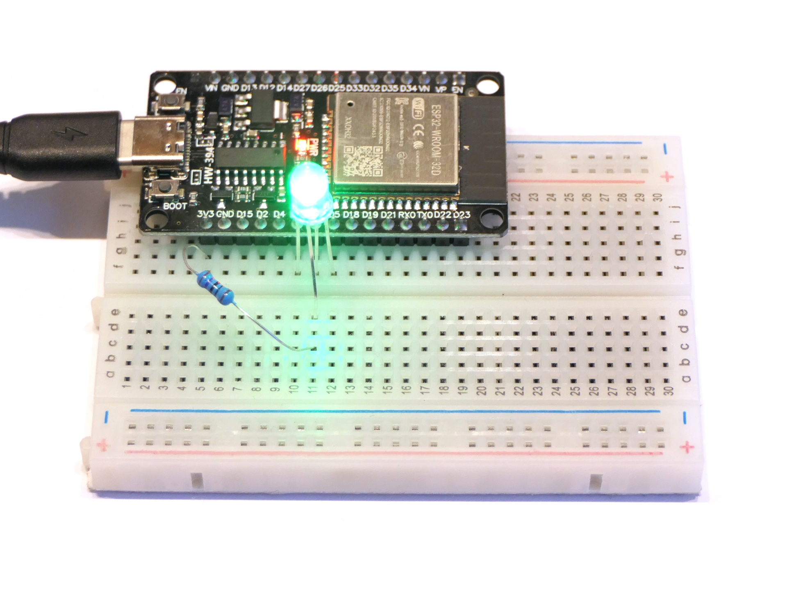

# Erstes Programm

Unser allererstes Programm steuert eine RBG-LED so an, dass abwechselnd die drei Grundfarben gezeigt werden.

## Aufbau

Biege das längste Bein (die Anode) der LED etwas nach außen und verbinde es über einen 270Ω- oder 330Ω-Widerstand direkt mit 3,3V-Pin des ESP32. Schließe das verbleibende einzelne Bein an Pin 16 an und die beiden anderen an Pin 17 und 5.

## Hinweise/Erläuterungen

Die RGB-LED besteht intern aus drei winzigen LEDs in den Farben rot, grün und blau. Sie haben eine gemeinsame Anode, d.h. Pluspol. Die Farben werden also über die Kathoden, d.h. die Minuspole, geschaltet. Eine Farbe leuchtet also dann, wenn der entsprechende Pin des ESP32 auf LOW (bzw. FALSE oder 0) gesetzt wird. HIGH (bzw. TRUE oder 1) schaltet die Farbe hingegen aus.