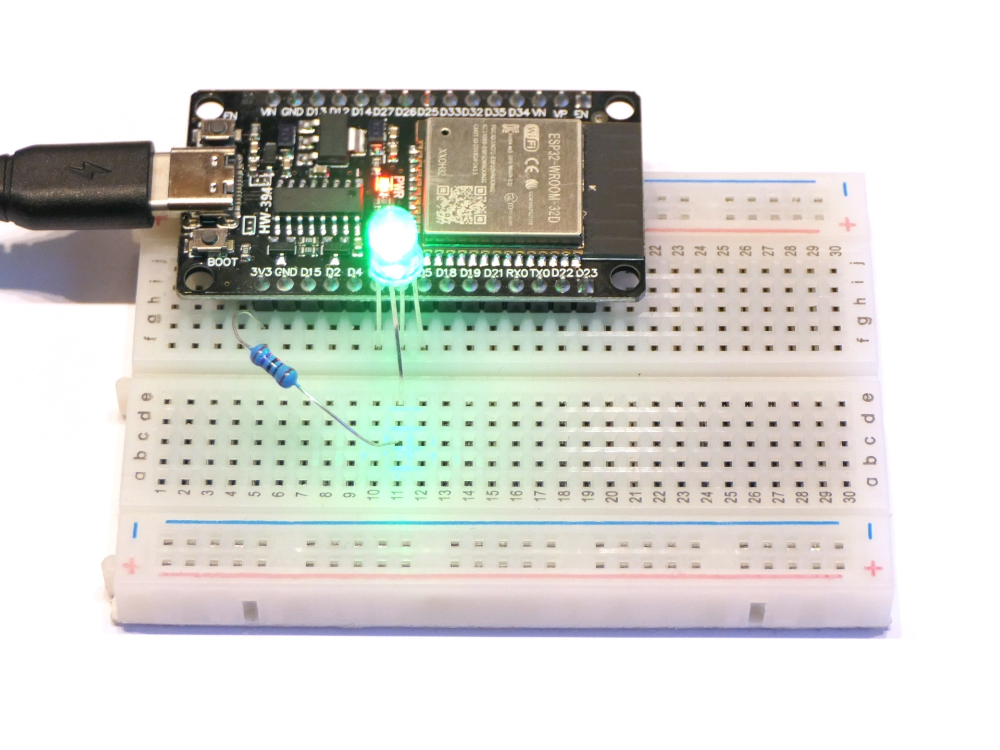

# PWM-gesteuerte LED

Auch dieses Programm schaltet durch die drei Grundfarben der RGB-LED, lässt die Helligkeit aber jeweils an- und wieder abschwellen.

## Aufbau

Der Aufbau ist identisch wie beim [ersten Programm](../First_program/).

## Hinweise/Erläuterungen

Die Pins des ESP32 können normalerweise nur digital LOW/FALSE/0 (= 0,0V) bzw. HIGH/TRUE/1 (= 3,3V) geschaltet werden. Nur zwei Pins (25 und 26) können echt analog zwischen 0,0 und 3,3V eingestellt werden. Alle Pins unterstützen aber *Pulsweitenmodulation*, kurz PWM. Bei dieser wird sehr schnell zwischen LOW und HIGH gewechselt. Über `analogWrite(pin, i)` kann das zeitliche Verhältnis eingestellt werden. Bei `i=0` ist der Pin dauerhaft LOW, bei `i=25` ist er 10% der Zeit HIGH, bei `i=128` ist er 50% der Zeit HIGH und bei `i=255` ist er dauerhaft HIGH. Das Auge nimmt das schnelle Umschalten zwischen LOW und HIGH nicht wahr, sondern erkennt nur unterschiedliche Helligkeiten. 