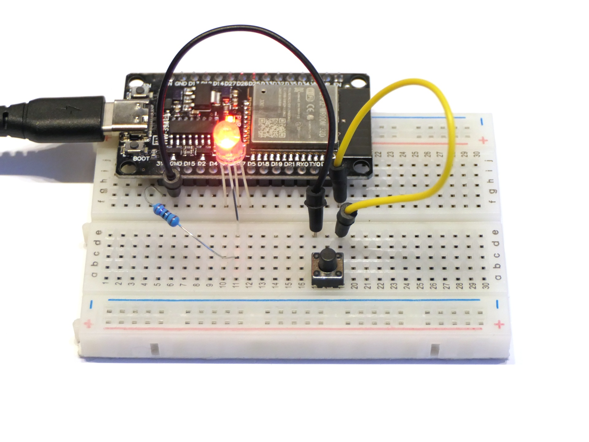

# RGB-LED mit Taster

Bei diesem Programm zeigt die RBG-LED wieder abwechselnd die drei Grundfarben an, aber nur während ein Taster gedrückt wird. Ansonsten bleibt die letzte Farbe dauerhaft an.

## Aufbau

Der Aufbau für die beiden vorherigen Programme wird um einen Taster zwischen Pin 23 und GND ergänzt.

## Hinweise/Erläuterungen

Durch die Programmzeile `pinMode(BUTTON_PIN, INPUT_PULLUP)` mit `BUTTON_PIN = 23` wird der Pin 23 als Eingang konfiguriert, aber gleichzeitig über einen internen Widerstand nach oben, d.h. auf 3,3V, „gezogen“ (auf Englisch *pull up*). Normalerweise gibt `digitalRead(BUTTON_PIN)` daher HIGH (bzw. TRUE oder 1) zurück. Wenn der Taster gedrückt gedrückt ist, so gibt die Funktion hingegen LOW (bzw. FALSE oder 0), zurück.

Außerdem verwendet das Programm den seriellen Bus (UART) zur Ausgabe von Statusmeldungen (Logging) über die USB-Verbindung. Die Meldungen können in der Arduino IDE unter **Tools → Serial Monitor** live angesehen werden.