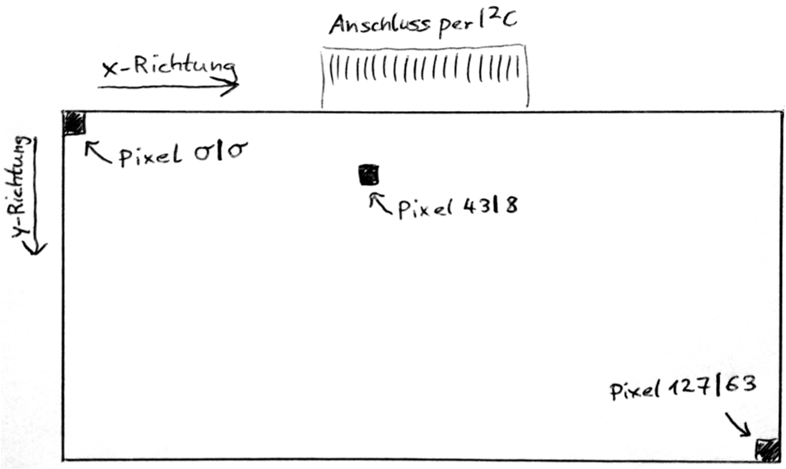
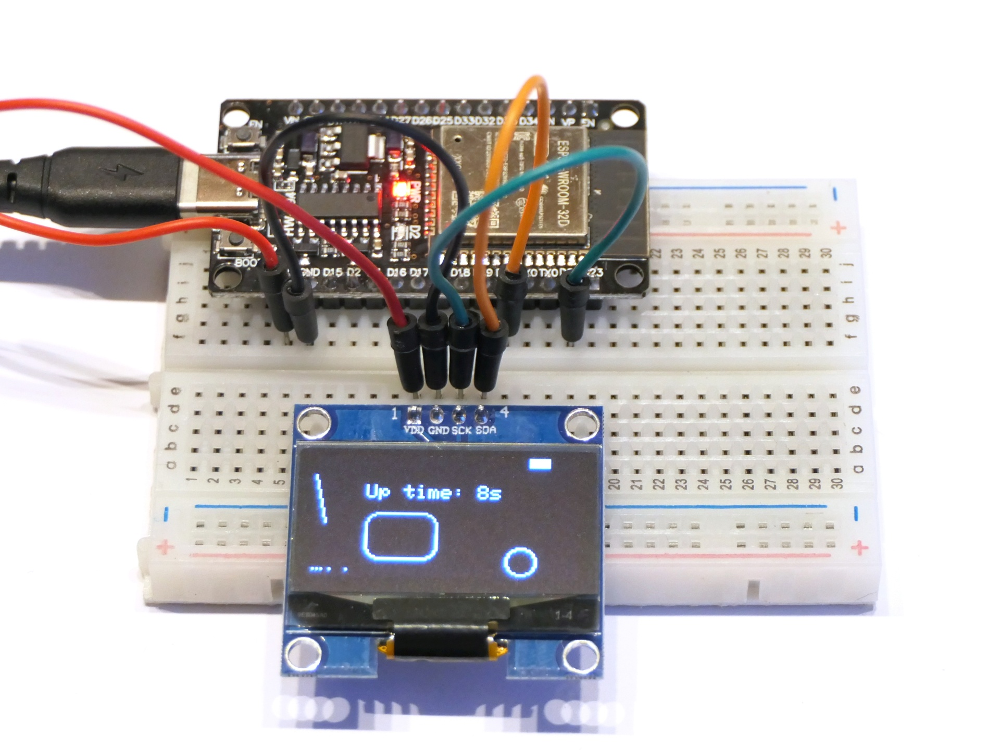

# Grundlagen des OLED-Displays

Dieses Programm demonstriert die Verwendung des 1,3-Zoll-OLED-Displays und die wichtigsten Funktionen zum Zeichnen. Beachte, dass die Y-Achse bei Displays normalerweise nach unten zeigt:

## Aufbau

Verbinde die vier Pins des Displays wie folgt mit dem ESP32: VDD an 3V3, GND and GND, SCK an Pin 21 und SDA an Pin 22.

## Hinweise/Erläuterungen

Das Display wird über das [I²C-Protokoll](https://de.wikipedia.org/wiki/I%C2%B2C) angesprochen. Der ESP32 unterstützt dieses Protokoll standardmäßig auf den Pins 21 und 22. Pin 21 gibt den Takt vor (auf Englisch *clock*), daher wird der Pin auf auch *Serial Clock* (kurz SCL oder SCK) genannt. Über Pin 22 werden die Daten gesendet bzw. empfangen, daher wird der Pin auch *Serial Data* (kurz SDA) genannt.

I²C unterstützt mehrere Geräte gleichzeitig, die durch Hardware-Adressen – eine Zahl zwischen 0 und 127 – unterschieden werden. Das hier verwendete Display hat die Adresse `0x3c` (hexadezimal), also dezimal die `60`.
