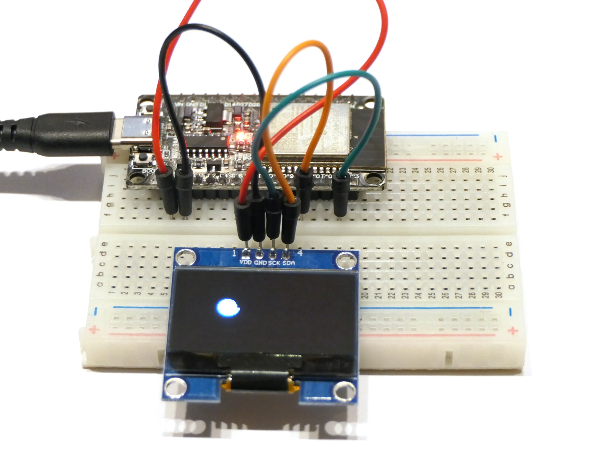

# Rollende Kugel

Nun bist du gefordert: Das Programm simuliert eine Kugel, die horizontal über den Bildschirm rollt und an den Seiten abprallt. Kannst du es so erweitern, dass die Kugel schräg rollt und auch am oberen und unteren Bildschirmrand abprallt?

## Aufbau

Der Aufbau ist identisch wie im [vorherigen Programm](../Display_basics/).

## Hinweise/Erläuterungen

Tipp: Versuche das Programm zunächst vollständig zu verstehen. Dupliziere dann die relevanten Programmzeilen und adaptiere sie von X zu Y.