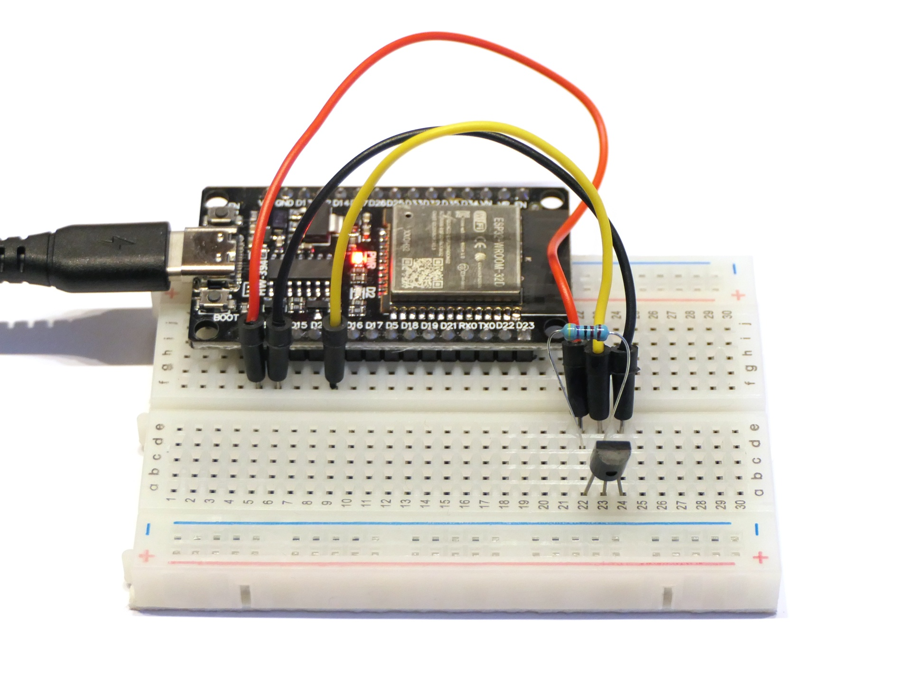

# Temperatursensor DS18B20

Dieses Programm liest einen Dallas DS18B20 aus und gibt die Werte über den seriellen Bus aus.

## Aufbau

Schließe den DS18B20 von der runden Seite aus gesehen wie folgt an: Linkes Bein an Pin 3V3, mittleres Bein an Pin 4 und das rechte Bein an GND. Verbinde das mittlere Bein ferner über einen 4,7kΩ-Widerstand (als Pull-Up-Widerstand) mit dem Pluspol.

## Datenblatt

Siehe [www.analog.com/media/en/technical-documentation/data-sheets/ds18b20.pdf](https://www.analog.com/media/en/technical-documentation/data-sheets/ds18b20.pdf).

## Hinweise/Erläuterungen

In der Arduino IDE kann der Verlauf der Werte über **Tools → Serial Plotter** auch grafisch dargestellt werden.

## Aufgaben/Erweiterungen

* Könnt ihr den anderen Teams erklären, wie der Sensor funktioniert und wie die Messwerte vom Sensor in den ESP32 kommen?
* Falls ihr genug Zeit habt: Schließt das OLED-Display an und gebt die Temperaturwerte auf diesem aus.