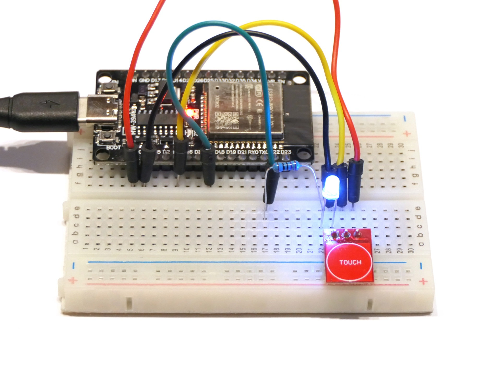

# Berührungssensor TTP223

Dieses Programm liest den TTP223 aus und schaltet damit eine LED. Der Zustand der LED wird auch über den seriellen Bus ausgegeben.

## Aufbau

Schließe den TTP223 wie folgt an den ESP32 an: VCC an 3V3, I/O an Pin 4 und GND an GND. Installiere zusätzlich eine LED mit 270Ω- oder 330Ω-Vorwiderstand zwischen Pin 5 und GND.

## Datenblatt

Es gibt verschiedene Datenblätter zum Sensor, sogar auf Deutsch: Z.B. [www.berrybase.de/en/product-datasheet/019234a3fd5d73d7b12d7652ab6ceccb/create](https://www.berrybase.de/en/product-datasheet/019234a3fd5d73d7b12d7652ab6ceccb/create).

## Hinweise/Erläuterungen

Zum Erkennen des Beginns der Berührung wird ein Interrupt-Handler verwendet. Dieser unterbricht den normalen Programmfluss. Die entsprechende Funktion wird mit dem Schlüsselwort `IRAM_ATTR` annotiert. Globale Variablen, die im Interrupt-Handler verwendet werden, müssen mit `volatile` deklariert werden.

## Aufgaben/Erweiterungen

* Könnt ihr den anderen Teams erklären, wie der Sensor und insbesondere der Interrupt-Handler funktionieren?