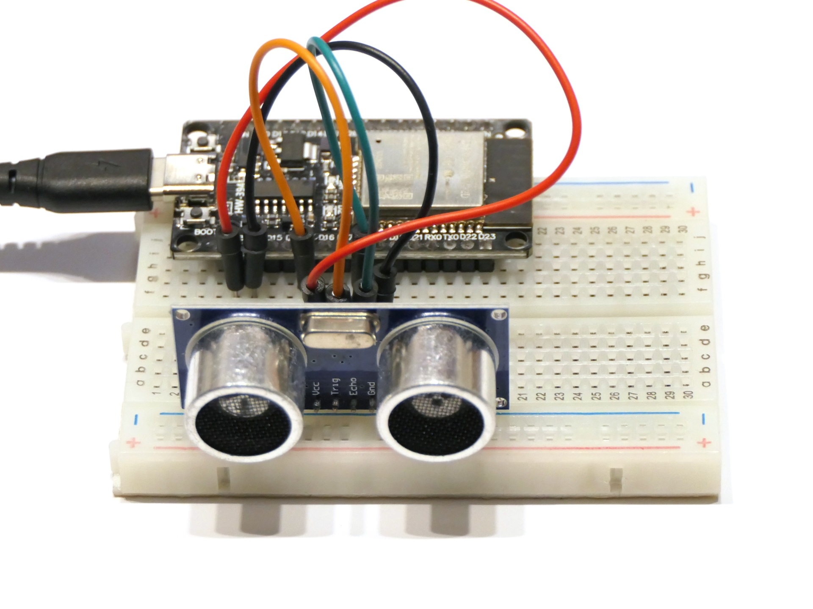

# Ultraschall-Abstandssensor HC-SR04

Dieses Programm liest einen verwendet einen HC-SR04 zur Abstandsmessung zu Hindernissen und gibt die Entfernungen über den seriellen Bus aus.

## Aufbau

Schließe den HC-SR04 wie folgt an den ESP32 an: Vcc an 3V3, Trig an Pin 4, Echo an Pin 5 und Gnd an GND.

## Datenblatt

Es gibt verschiedene Datenblätter zum Sensor, sogar auf Deutsch: Z.B. [www.mikrocontroller.net/attachment/218122/HC-SR04_ultraschallmodul_beschreibung_3.pdf](https://www.mikrocontroller.net/attachment/218122/HC-SR04_ultraschallmodul_beschreibung_3.pdf).

## Hinweise/Erläuterungen

In der Arduino IDE kann der Verlauf der Werte über **Tools → Serial Plotter** auch grafisch dargestellt werden.

## Aufgaben/Erweiterungen

* Könnt ihr den anderen Teams erklären, wie der Sensor funktioniert und wie die Messwerte vom Sensor in den ESP32 kommen?
* Falls ihr genug Zeit habt: Schließt das OLED-Display an und gebt die Messwerte auf diesem aus.