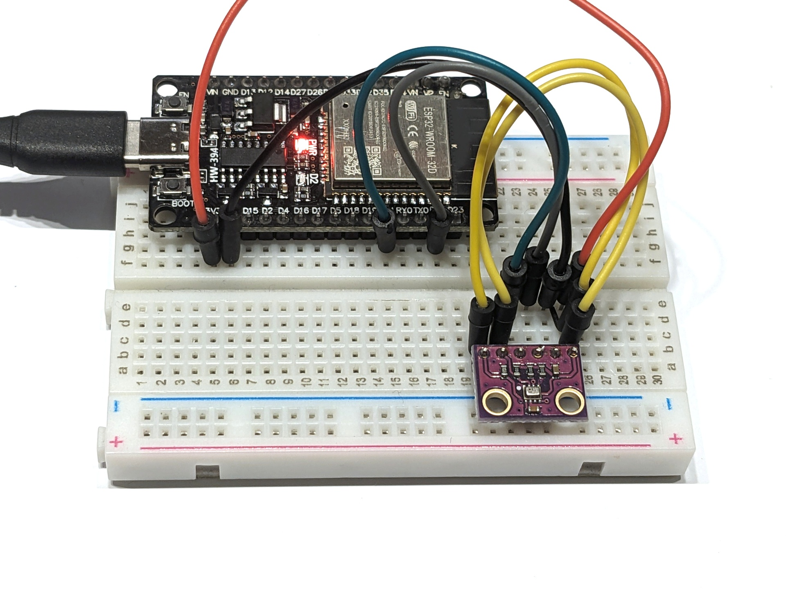

# Luftdrucksensor BMP280

Der BMP280 ist ein kombinierter Luftdruck- und Temperatursensor von Bosch. Dieses Programm liest die Luftdruck- und Temperaturwerte vom Sensor aus und gibt sie über den seriellen Bus aus.

## Aufbau

Schließe den BMP280 wie folgt an den ESP32 an: VIN an 3V3, GND an GND, SCL an Pin 22 und SDA an Pin 21. CSB und SD0 werden beide an VIN bzw. 3V3 angeschlossen.

## Datenblatt

Siehe [www.bosch-sensortec.com/products/environmental-sensors/pressure-sensors/bmp280/](https://www.bosch-sensortec.com/products/environmental-sensors/pressure-sensors/bmp280/).

## Hinweise/Erläuterungen

Es gibt auch Platinen mit dem BMP280 mit nur vier Anschlüssen, ohne CSB und SD0.