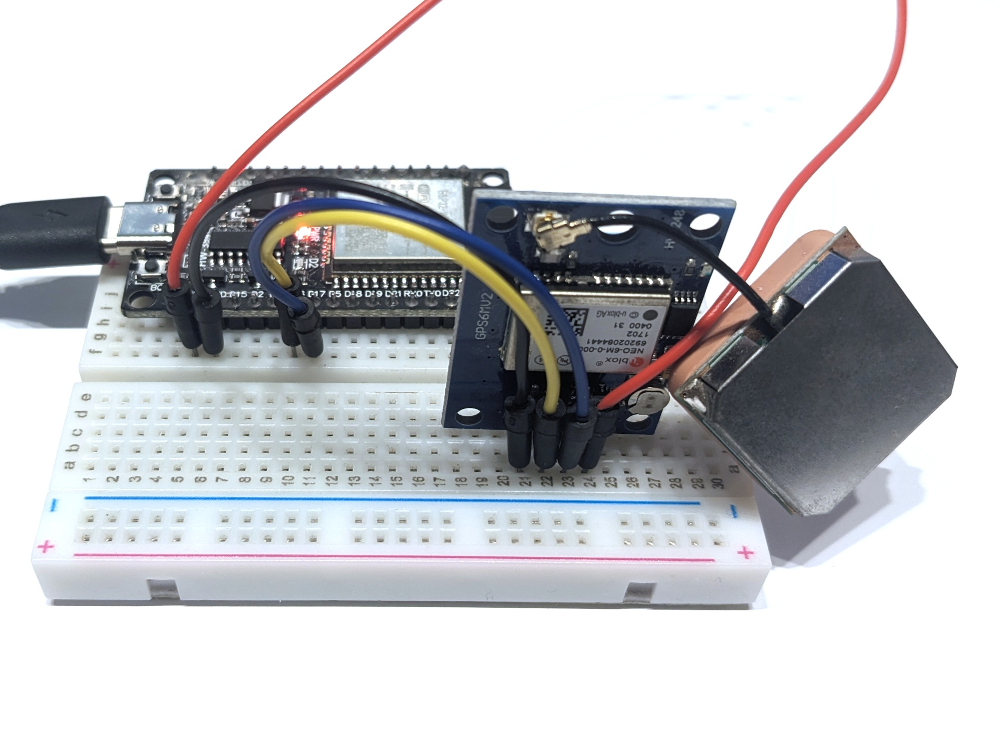

# GPS-Modul NEO-6M

Das GPS-Modul NEO-6M ist ein (inzwischen älterer) typischer GPS-Empfänger, der das [NMEA-Protokoll](https://de.wikipedia.org/wiki/NMEA_0183) unterstützt. Dieses Programm liest die NMEA-Zeilen vom GPS-Modul in einen Parser ein und gibt die NMEA-Zeilen selbst sowie die Position (Breiten- und Längengrad) sowie die Geschwindigkeit über den seriellen Bus aus.

## Aufbau

Schließe das NEO-6M wie folgt an den ESP32 an: GND an GND, TX an Pin 16, RX an Pin 17 und VCC and 3V3.

## Datenblatt

Siehe [www.u-blox.com/en/product/neo-6-series](https://www.u-blox.com/en/product/neo-6-series).

## Hinweise/Erläuterungen

Es dauert einige Minuten bis das GPS-Modul alle notwendigen Bahndaten (den *Almanach*) von den GPS-Satelliten empfangen hat, um eine Position zu berechnen. Geräten mit Internetverbindung (z.B. Smartphone) geht das schneller, weil sie Almanach über Internet-Dienste empfangen können.
