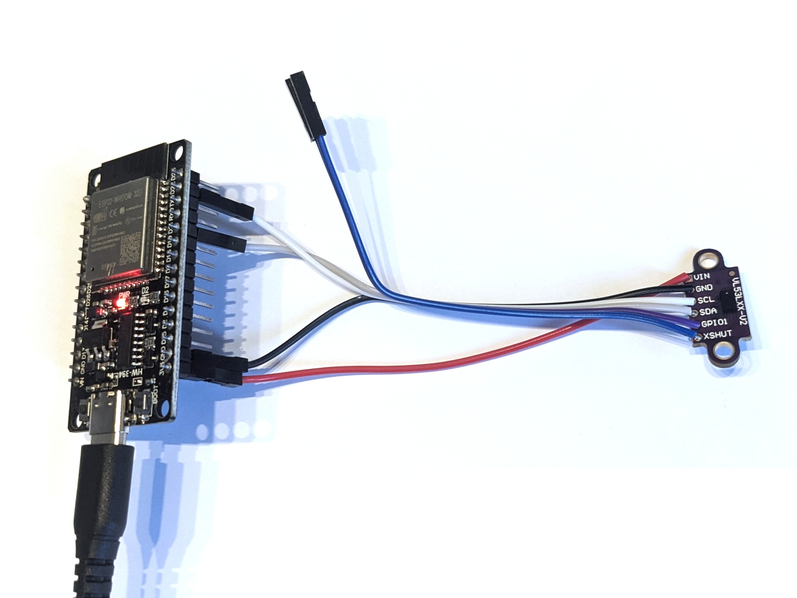

# Laser-ToF-Sensor VL53L0X

Der Laser-ToF-Sensor VL53L0X kann mit Infrarotlichtimpulsen Entfernungen von wenigen Millimetern bis zu mehreren Metern messen. Dieses Programm liest einen VL53L0X (bzw. VL53LXX-V2) aus und gibt die Werte über den seriellen Bus aus.

## Aufbau

Schließe den VL53L0X wie folgt an den ESP32 an: VIN an 3V3, GND an GND, SCL an Pin 22 und SDA an Pin 21. Die Anschlüsse GPIO1 und XSHUT müssen nicht verbunden werden.

## Datenblatt

Siehe [www.st.com/resource/en/datasheet/vl53l0x.pdf](https://www.st.com/resource/en/datasheet/vl53l0x.pdf).

## Hinweise/Erläuterungen

In der Arduino IDE kann der Verlauf der Werte über **Tools → Serial Plotter** auch grafisch dargestellt werden.
