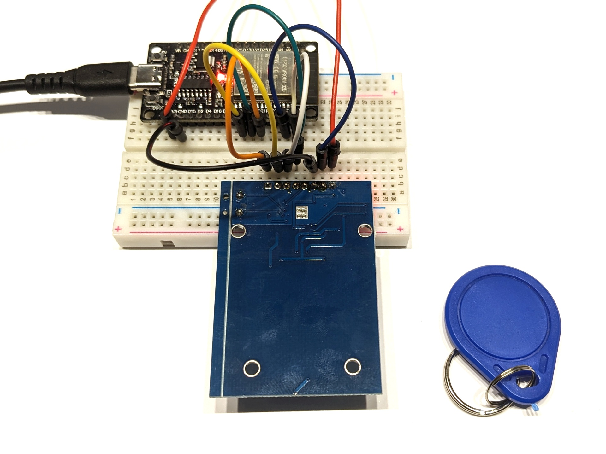

# RFID-Reader MFRC522

Der RFID-Reader MFRC522 kann typische RFID-Karten und -Chips für 13,56 MHz auslesen.

## Aufbau

Schließe den MFRC522 wie folgt an den ESP32 an: SDA an Pin 21, SCK an Pin 18, MOSI an Pin 23, MISO an Pin 19, GND an GND, RST an Pin 22 und 3.3V an 3V3. Der Anschluss IRQ muss nicht angeschlossen werden.

## Datenblatt

Siehe [www.handsontec.com/dataspecs/RC522.pdf](http://www.handsontec.com/dataspecs/RC522.pdf).

## Hinweise/Erläuterungen

In der Library MFRC522 müssen in *MFRC522Extended.cpp* eventuell die Zeilen 824 und 847 jeweils um `(void*)` zu `if (backData && (backLen > (void*) 0)) {` ergänzt werden.
