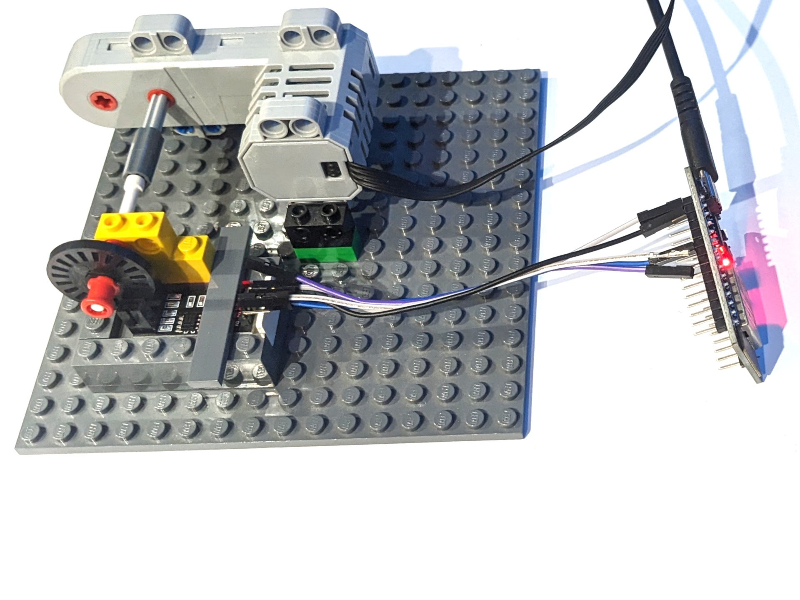

# Geschwindigkeitssensor LM393

Der LM393 detektiert mittels einer Infrarotlichtschranke die Umdrehungsschritte einer Achse, woraus die Drehzahl der Achse bzw. die Geschwindigkeit eines entsprechenden Fahrzeugs bestimmt werden kann. Dieses Programm erfasst die Schritte über den Zeitraum von einer Sekunde und gibt die Drehzahl über den seriellen Bus aus.

## Aufbau

Schließe den LM393 wie folgt an den ESP32 an: GND an GND, VCC an 3V3 und D0 an Pin 16. Der Anschluss A0 muss nicht angeschlossen werden.

## Datenblatt

Siehe [joy-it.net/files/files/Produkte/SEN-Speed/Datenblatt-SEN-Speed.pdf](https://joy-it.net/files/files/Produkte/SEN-Speed/Datenblatt-SEN-Speed.pdf).
