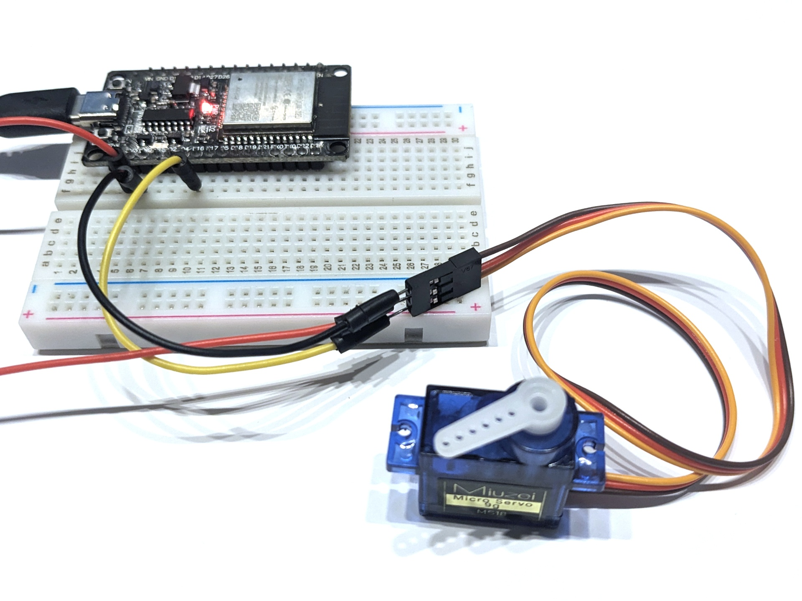

# Stepper-Motor

Dieses Programm steuert einen typischen, einfachen Stepper-Motor an und lässt ihn periodisch zwischen einigen fest programmierten Winkeln wechseln.

## Aufbau

Schließe den Stepper-Motor wie folgt an den ESP32 an: Rotes Kabel an 3V3, schwarzes/braunes Kabel an GND und das gelbe Kabel an Pin 16.

## Datenblatt

Siehe z.B. [www.mpja.com/download/31002md%20data.pdf](https://www.mpja.com/download/31002md%20data.pdf).
