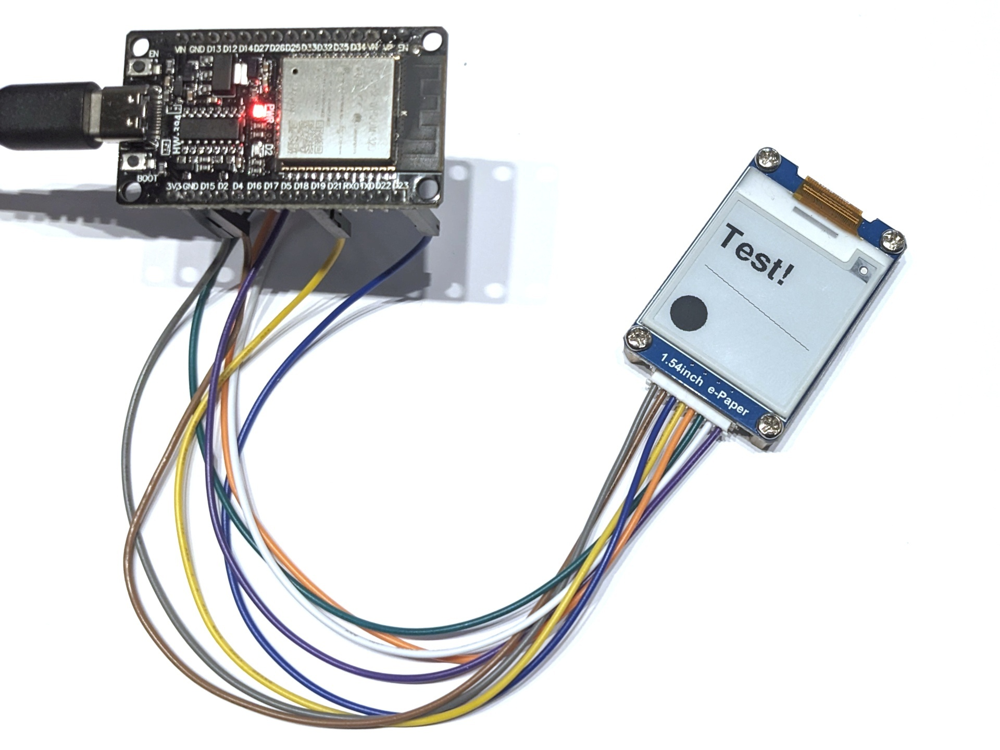

# Waveshare 1,54 Zoll eInk Display

Das Waveshare 1,54 Zoll ist ein kleines eInk-Display mit 200x200 Pixeln Auflösung. Es unterstützt nur die Farben Schwarz und Weiß. Dieses Programm demonstriert die Verwendung mit einigen einfachen Zeichenbefehlen.

## Aufbau

Schließe das Display wie folgt an den ESP32 an: BUSY in Pin 27, RST and Pin 33, DC an Pin 25, CS an Pin 26, CLK an Pin 18, DIN an Pin 23, GND an GND und VCC an 3V3.

## Datenblatt

Siehe [www.waveshare.com/1.54inch-e-paper-module.htm](https://www.waveshare.com/1.54inch-e-paper-module.htm).

## Hinweise/Erläuterungen

Das Display wird durch das Programm abgeschaltet und kann abgesteckt werden ohne, dass das Bild verschwindet.
