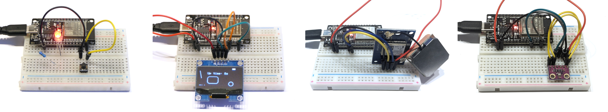

# Microcontroller-Workshop „Hands on ESP32“

Microcontroller-Workshop am 25. Januar 2025 in der Christian-Wagner-Bücherei in Rutesheim, im Nachgang zur 2. Ausstellung „Maker Space Connect“ im November/Dezember 2024.

Autor: [Ralph Lange](https://github.com/ralph-lange/)

## Vorbereitung

Alle Teilnehmerinnen und Teilnehmer erhalten per E-Mail vorab Instruktionen zur Installation der Arduino IDE auf dem eigenen Laptop.

## Inhalt

* Kapitel 1 Grundlagen
  * [Erstes Programm](Chapter_1_Basics/First_program/)
  * [PWM-gesteuerte LED](Chapter_1_Basics/PWM-controlled_RGB_LED/)
  * [RGB-LED mit Taster](Chapter_1_Basics/RGB_LED_with_switch/)
* Kapitel 2 OLED-Display
  * [Grundlagen des OLED-Displays](Chapter_2_OLED_display/Display_basics/)
  * [Rollende Kugel](Chapter_2_OLED_display/Rolling_sphere/)
* Kapitel 3 Sensoren
  * [Temperatursensor DS18B20](Chapter_3_Sensors/Temperature_sensor_DS18B20/)
  * [Berührungssensor TTP223](Chapter_3_Sensors/Touch_sensor_TTP223/)
  * [Ultraschall-Abstandssensor HC-SR04](Chapter_3_Sensors/Ultrasonic_distance_sensor_HC-SR04/)
* Kapitel 4 Konnektivität und Cloud
  * [ESP32 als Webserver](Chapter_4_Connectivity_and_Cloud/ESP32_webserver/)
  * [MQTT-Publisher](Chapter_4_Connectivity_and_Cloud/MQTT_publisher/)
  * [ThingSpeak-Sender](Chapter_4_Connectivity_and_Cloud/ThingSpeak_sender/)
* *Mehr Sensoren und Devices*
  * [Luftdrucksensor BMP280](More_sensors_and_devices/Barometric_pressure_sensor_BMP280/)
  * [GPS-Modul NEO-6M](More_sensors_and_devices/GPS_module_NEO-6M/)
  * [Laser-ToF-Sensor VL53L0X](More_sensors_and_devices/Laser_ToF_sensor_VL53L0X/)
  * [RFID-Reader MFRC522](More_sensors_and_devices/RFID_reader_MFRC522/)
  * [Geschwindigkeitssensor LM393](More_sensors_and_devices/Speed_sensor_LM393/)
  * [Stepper-Motor](More_sensors_and_devices/Stepper_motor/)
  * [Waveshare 1,54 Zoll eInk Display](More_sensors_and_devices/Waveshare_154_eInk_display/)

## Weiterführende Hinweise

Einige Hinweise zur weiteren Verwendung der Hardware und für eigene Projekte:

* Die Pins des ESP32 haben teilweise Sonderfunktionen, wie z.B. Unterstützung für spezielle Protokolle (UART, SPI, I²C) oder Analogfunktionen. Einige Pins (typischerweise 34, 35, 36 und 39) sind nur als Eingänge verwendbar. Wenn man in einer Suchmaschine nach „ESP32 Pinout“ sucht, so lassen sich schnell Grafiken finden, auf denen die Pins genau beschrieben sind. Dabei muss der exakte Typ/Version des ESP32-Moduls beachtet werden.
* Bei vielen ESP32-Modulen muss zum Flashen der Boot-Knopf kurz gedrückt werden, wenn in der Arduino IDE nach dem Kompilieren eine Folge von Punkten erscheint.
* Zur Programmierung gibt es einige Alternativen zur Arduino IDE, z.B. [PlatformIO](https://platformio.org/). Statt C/C++ kann unter anderem auch in MicroPython programmiert werden, vgl. [docs.micropython.org/en/latest/esp32/tutorial/intro.html](https://docs.micropython.org/en/latest/esp32/tutorial/intro.html).
* Wenn man in einschlägigen Online-Shops nach „Microcontroller Set“, „MCU Sensor Kit“, „Elektronik Starter Kit“ oder ähnlich sucht, so finden sich viele Sets/Kits, die eine geeignete Auswahl an Kabeln, Schaltern, Sensoren, Displays, etc. für weitere Projekte bieten.
* Beim ESP32C3 Mini kannst du die Pin-Leisten zu Hause selbst anlöten. Überlege dir vorher, ob du sie nach unten (z.B. zum Aufstecken auf eine Steckplatine) oder nach oben (zum Anschluss von Jumper-Kabeln mit Buchsen) anbringen möchtest.

## Hardware

Die für den Workshop verwendete Hardware umfasst unter anderem:

* ESP32 DevKit (ESP-WROOM-32 ESP32-S mit USB-C-Anschluss)
* ESP32C3 Mini (XIAO)
* 1.3" OLED Display Modul weiß/blau mit Chip SH1106
* Temperatursensor Dallas DS18B20
* Ultraschallsensor HC-SR04
* Berührungssensor TTP223
* RGB-LED

Dazu kommen Steckplatine, USB-C-Datenkabel, weitere LEDs, Schalter, Jumperkabel, Widerstände, etc.

## Lizenz

Die Inhalte dieses Workshops sind unter der [3-Clause BSD Lizenz](LICENSE) veröffentlicht.
